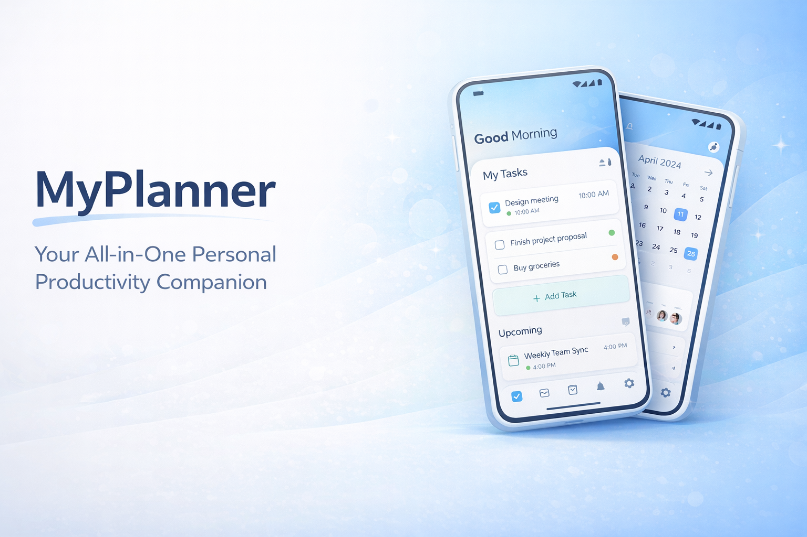
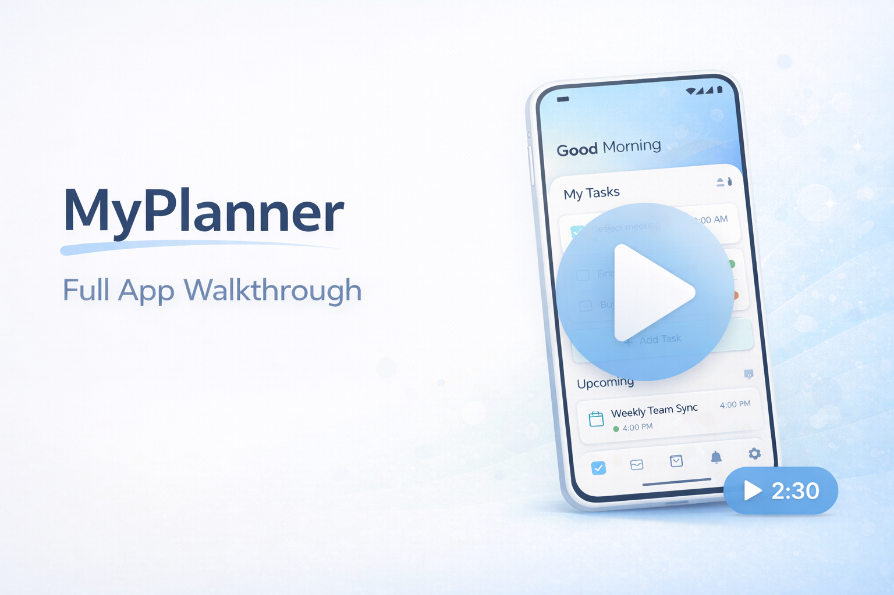
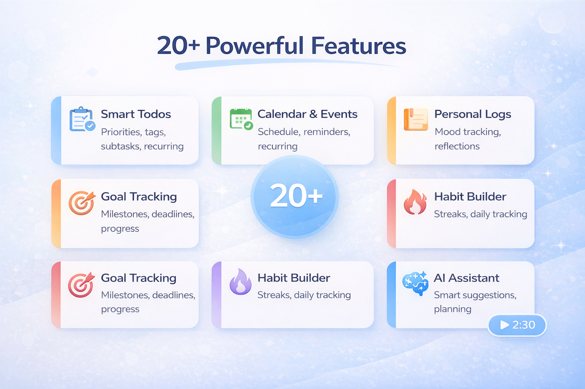
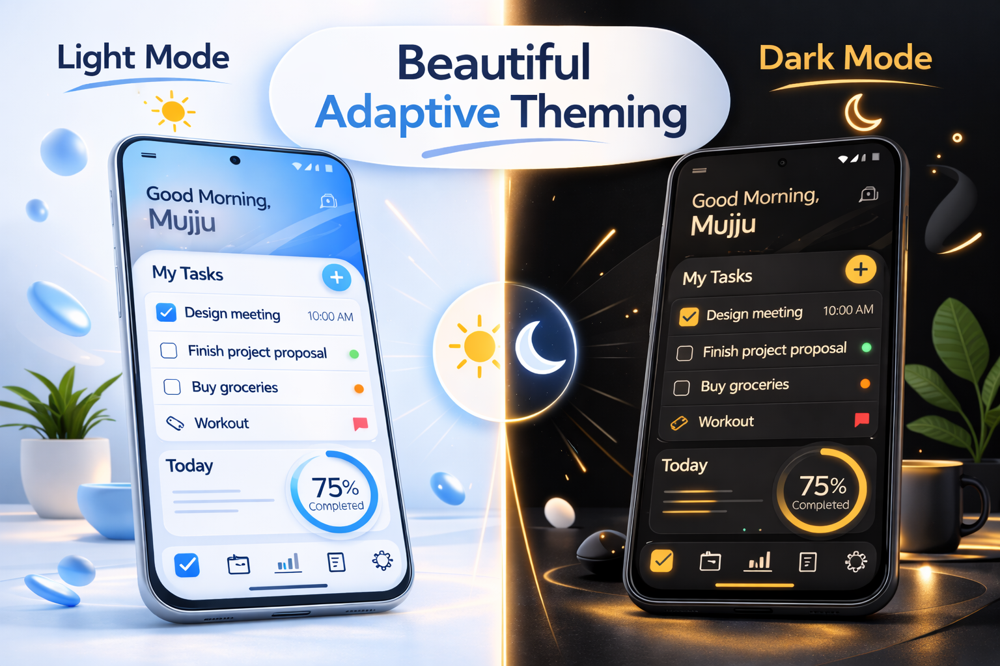
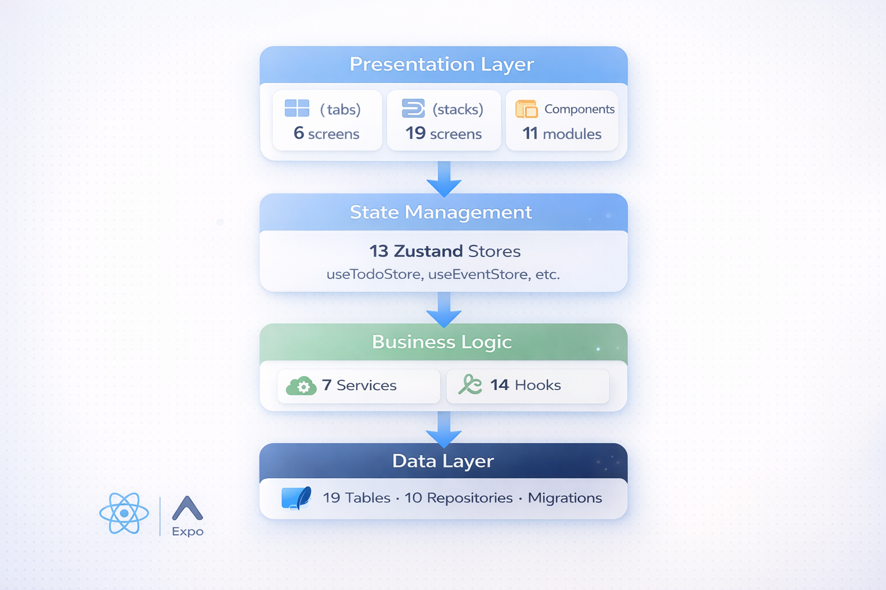
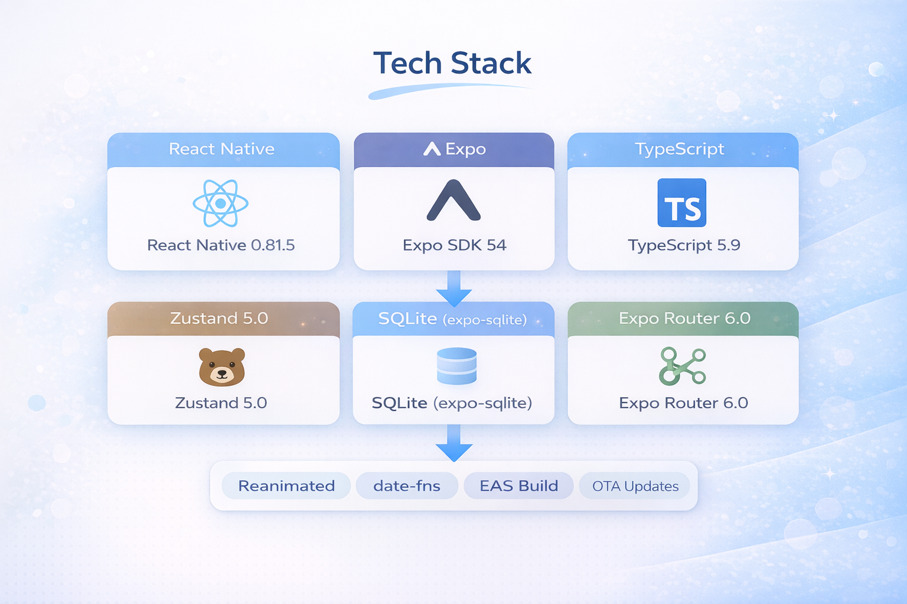
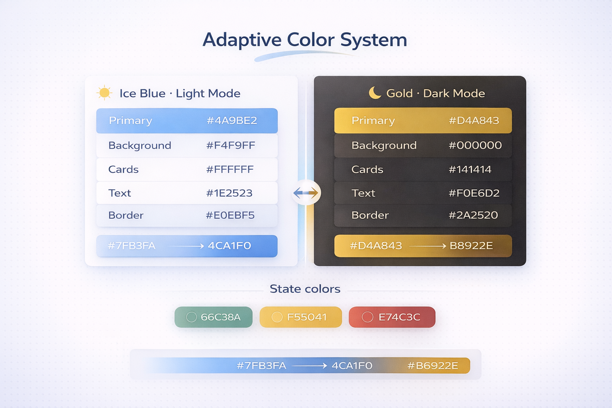
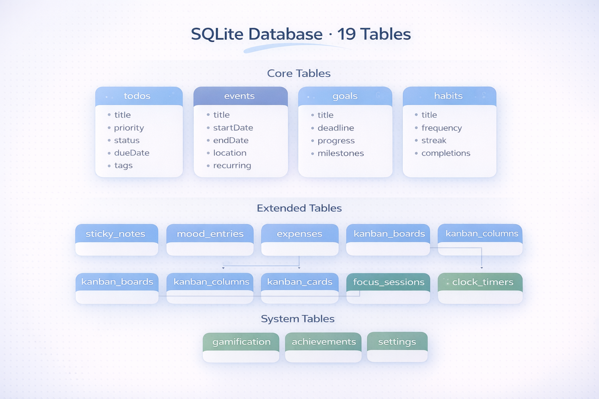

<p align="center">
  
</p>

<h1 align="center">Plandex</h1>
<p align="center">
  <strong>Your All-in-One Personal Productivity Companion</strong>
</p>
<p align="center">
  A privacy-first, offline-capable mobile app built with React Native & Expo.<br/>
  Your data never leaves your device unless you choose to export it.
</p>

<p align="center">
  
  
  
  
  
  
</p>

<p align="center">
  
</p>

---

## 🎬 Demo

<p align="center">
  <a href="https://github.com/mujju-212/myplanner/releases">
    
  </a>
</p>

<p align="center">
  <em>▶️ Click the image above to watch the full app walkthrough</em>
</p>

---

## 🖼️ Preview

<p align="center">
  
</p>

<p align="center">
  
</p>

---

## ✨ Features

### 📋 Core Productivity
| Feature | Description |
|---------|-------------|
| **Todo Management** | Create, organize & track tasks with priorities, tags, subtasks, recurring schedules & due dates |
| **Calendar & Events** | Full calendar view with event scheduling, recurring events & time-based reminders |
| **Personal Logs** | Daily journaling with mood tracking, productivity ratings & reflections |
| **Goals Tracker** | Set & track long-term goals with milestones, deadlines & progress visualization |
| **Habit Builder** | Build positive habits with streak tracking, reminder times & completion stats |
| **Projects** | Organize work into projects with task breakdown & progress tracking |

### 🧩 Extended Features
| Feature | Description |
|---------|-------------|
| **Sticky Notes** | Quick colorful notes for instant thoughts |
| **Mood Tracker** | Track daily mood patterns with emoji-based logging |
| **Expense Tracker** | Track spending & income with category breakdowns |
| **Kanban Board** | Visual drag-and-drop task workflow management |
| **Focus Mode** | Pomodoro-style timer for deep work sessions |
| **Flip Clock** | Beautiful clock with timer & stopwatch |
| **Weekly/Monthly Reviews** | Structured review templates for reflection |
| **Planning Workspace** | Project workspace with file management |

### 🎮 Engagement & Intelligence
| Feature | Description |
|---------|-------------|
| **Gamification** | Earn XP, level up, maintain streaks & unlock achievement badges |
| **AI Assistant** | AI-powered productivity suggestions & planning help |
| **Smart Search** | Search across all data — todos, events, logs, goals, habits |
| **Analytics Dashboard** | Visualize productivity patterns, completion rates & trends |
| **Achievements** | 50+ milestone badges to unlock |
| **Notifications** | Morning schedule digest & evening log reminders |

### 🔒 Privacy & Data
| Feature | Description |
|---------|-------------|
| **100% Offline-First** | All data stored locally with SQLite — no cloud required |
| **Dark Mode** | Beautiful dark & light themes with native picker support |
| **Export/Import** | Full JSON backup & restore of all your data |
| **OTA Updates** | Automatic over-the-air updates — no reinstall needed |
| **No Account Required** | No sign-up, no login, no tracking |

---

## 🏗️ Architecture

<p align="center">
  
</p>

### High-Level Architecture

```
┌─────────────────────────────────────────────────────────────┐
│                        PRESENTATION                         │
│  ┌─────────────┐  ┌─────────────┐  ┌─────────────────────┐ │
│  │  (tabs)      │  │  (stacks)   │  │  Components         │ │
│  │  ─ index     │  │  ─ todo/*   │  │  ─ common/          │ │
│  │  ─ calendar  │  │  ─ event/*  │  │  ─ dashboard/       │ │
│  │  ─ todos     │  │  ─ goal/*   │  │  ─ calendar/        │ │
│  │  ─ logs      │  │  ─ habit/*  │  │  ─ gamification/    │ │
│  │  ─ more      │  │  ─ log/*    │  │  ─ todo/ goal/      │ │
│  │  ─ explore   │  │  ─ notes    │  │  ─ habit/ log/      │ │
│  │              │  │  ─ mood     │  │  ─ analytics/ ai/   │ │
│  │              │  │  ─ kanban   │  │  ─ project/         │ │
│  │              │  │  ─ focus    │  │                     │ │
│  │              │  │  ─ clock    │  │                     │ │
│  │              │  │  ─ expenses │  │                     │ │
│  │              │  │  ─ planning │  │                     │ │
│  └─────────────┘  └─────────────┘  └─────────────────────┘ │
├─────────────────────────────────────────────────────────────┤
│                      STATE MANAGEMENT                       │
│  ┌──────────────────────────────────────────────────────┐   │
│  │  Zustand Stores (13 stores)                          │   │
│  │  useTodoStore · useEventStore · useGoalStore         │   │
│  │  useHabitStore · useLogStore · useMoodStore          │   │
│  │  useNoteStore · useExpenseStore · useClockStore      │   │
│  │  usePlanningStore · useGamificationStore             │   │
│  │  useThemeStore · useSettingsStore                    │   │
│  └──────────────────────────────────────────────────────┘   │
├─────────────────────────────────────────────────────────────┤
│                      BUSINESS LOGIC                         │
│  ┌───────────────────┐  ┌────────────────────────────┐      │
│  │  Services (7)      │  │  Hooks (14)                │      │
│  │  todoService       │  │  useTodos · useEvents      │      │
│  │  eventService      │  │  useGoals · useHabits      │      │
│  │  goalService       │  │  useLogs · useSearch       │      │
│  │  habitService      │  │  useGamification           │      │
│  │  logService        │  │  useAnalytics · useTheme   │      │
│  │  gamificationSvc   │  │  useNotifications          │      │
│  │  notificationSvc   │  │  useAppState · useDebounce │      │
│  └───────────────────┘  └────────────────────────────┘      │
├─────────────────────────────────────────────────────────────┤
│                       DATA LAYER                            │
│  ┌───────────────────────────────────────────────────┐      │
│  │  SQLite Database (expo-sqlite)                    │      │
│  │  ┌──────────────────────────────────────────┐     │      │
│  │  │  Repositories (10)                       │     │      │
│  │  │  todoRepo · eventRepo · goalRepo         │     │      │
│  │  │  habitRepo · logRepo · moodRepo          │     │      │
│  │  │  noteRepo · expenseRepo · clockRepo      │     │      │
│  │  │  planningRepo                            │     │      │
│  │  └──────────────────────────────────────────┘     │      │
│  │  19 Tables · Singleton Connection · Migrations    │      │
│  └───────────────────────────────────────────────────┘      │
└─────────────────────────────────────────────────────────────┘
```

### Directory Structure

```
myplanner/
├── app/                          # Expo Router pages
│   ├── _layout.tsx               # Root layout (theme, OTA updates)
│   ├── index.tsx                 # Entry point
│   ├── (tabs)/                   # Bottom tab navigation
│   │   ├── index.tsx             # Dashboard
│   │   ├── calendar.tsx          # Calendar view
│   │   ├── todos.tsx             # Todo list
│   │   ├── logs.tsx              # Daily logs
│   │   ├── explore.tsx           # Feature discovery
│   │   └── more.tsx              # Settings & profile
│   └── (stacks)/                 # Stack screens
│       ├── todo/                 # Todo CRUD
│       ├── event/                # Event CRUD
│       ├── goal/                 # Goal CRUD
│       ├── habit/                # Habit CRUD
│       ├── log/                  # Log views & reviews
│       ├── planning/             # Planning workspace
│       ├── notes.tsx             # Sticky notes
│       ├── mood.tsx              # Mood tracker
│       ├── kanban.tsx            # Kanban board
│       ├── expenses.tsx          # Expense tracker
│       ├── focus.tsx             # Focus/Pomodoro timer
│       ├── clock.tsx             # Flip clock
│       ├── analytics.tsx         # Analytics dashboard
│       ├── achievements.tsx      # Achievement badges
│       ├── search.tsx            # Global search
│       ├── settings.tsx          # App settings
│       ├── profile.tsx           # User profile
│       ├── notifications.tsx     # Notification center
│       └── onboarding.tsx        # First-time setup
│
├── src/                          # Core source code
│   ├── components/               # Reusable UI components
│   │   ├── common/               # Shared (Header, Sidebar, etc.)
│   │   ├── dashboard/            # Dashboard widgets
│   │   ├── calendar/             # Calendar components
│   │   ├── todo/                 # Todo-specific components
│   │   ├── goal/                 # Goal components
│   │   ├── habit/                # Habit components
│   │   ├── log/                  # Log components
│   │   ├── project/              # Project components
│   │   ├── analytics/            # Chart & analytics
│   │   ├── gamification/         # XP, badges, streaks
│   │   └── ai/                   # AI assistant
│   │
│   ├── database/                 # Data persistence
│   │   ├── database.ts           # SQLite connection (singleton)
│   │   ├── schema.ts             # Table definitions & migrations
│   │   └── repositories/         # Data access layer (10 repos)
│   │
│   ├── services/                 # Business logic (7 services)
│   ├── stores/                   # Zustand state management (13 stores)
│   ├── hooks/                    # Custom React hooks (14 hooks)
│   ├── theme/                    # Theme colors & styling
│   ├── types/                    # TypeScript type definitions
│   ├── config/                   # App configuration
│   ├── utils/                    # Utility functions
│   └── assets/                   # Fonts, animations, sounds
│
├── assets/                       # App icons, splash screens
├── resources/                    # README images & media
├── __tests__/                    # Test suites
│   ├── unit/                     # Unit tests
│   ├── integration/              # Integration tests
│   └── e2e/                      # End-to-end tests
│
├── app.json                      # Expo configuration
├── eas.json                      # EAS Build configuration
├── package.json                  # Dependencies
└── tsconfig.json                 # TypeScript config
```

---

## 🛠️ Tech Stack

<p align="center">
  
</p>

| Category | Technology | Version |
|----------|-----------|---------|
| **Framework** | React Native | 0.81.5 |
| **Platform** | Expo SDK | 54.0.33 |
| **Language** | TypeScript | 5.9.2 |
| **State** | Zustand | 5.0.11 |
| **Database** | SQLite (expo-sqlite) | 16.0.10 |
| **Navigation** | Expo Router (file-based) | 6.0.23 |
| **Animations** | React Native Reanimated | 4.1.1 |
| **Dates** | date-fns | 4.1.0 |
| **Icons** | Expo Vector Icons + Feather | 15.0.3 |
| **Updates** | Expo Updates (OTA) | 29.0.16 |
| **Notifications** | Expo Notifications | 0.32.16 |
| **Build** | EAS Build | Cloud |

---

## 🚀 Getting Started

### Prerequisites

- **Node.js** 18 or higher
- **npm** (comes with Node.js)
- **Expo Go** app on your phone ([Android](https://play.google.com/store/apps/details?id=host.exp.exponent) / [iOS](https://apps.apple.com/app/expo-go/id982107779))

### Quick Start

```bash
# 1. Clone the repository
git clone https://github.com/mujju-212/myplanner.git
cd myplanner

# 2. Install dependencies
npm install

# 3. Start the development server
npx expo start

# 4. Scan the QR code with Expo Go on your phone
```

### Install APK (Android)

Download the latest APK from [**Releases**](https://github.com/mujju-212/myplanner/releases) and install directly on your Android device.

> Enable "Install from unknown sources" in your Android settings if prompted.

---

## 📦 Build & Deploy

### Build APK

```bash
# Login to Expo
npx eas login

# Build production APK
npx eas build --platform android --profile production
```

### Push OTA Updates (No Reinstall!)

```bash
# After making code changes, push update to all users
npx eas update --branch production --message "Bug fixes and improvements"
```

Users get the update automatically next time they open the app.

---

## 🔄 Update System

Plandex uses **Expo OTA (Over-The-Air) Updates** so users never need to reinstall:

```
┌──────────────┐     ┌───────────────┐     ┌──────────────────┐
│  Developer   │────▶│  EAS Update   │────▶│  User's Device   │
│  pushes code │     │  (Expo CDN)   │     │  auto-downloads  │
└──────────────┘     └───────────────┘     └──────────────────┘
                                                    │
                                           ┌────────▼────────┐
                                           │ "Restart Now"   │
                                           │  dialog shown   │
                                           └─────────────────┘
```

| Update Type | When Needed | Command |
|-------------|------------|---------|
| **OTA Update** (JS/UI changes) | Most changes | `npx eas update --branch production` |
| **New APK** (native changes) | New packages, icon, permissions | `npx eas build --platform android` |

---

## 🎨 Theming

<p align="center">
  
</p>

| Property | Light Mode | Dark Mode |
|----------|-----------|-----------|
| **Primary** | `#4A9BE2` | `#D4A843` |
| **Background** | `#F4F9FF` | `#000000` |
| **Card** | `#FFFFFF` | `#141414` |
| **Text** | `#1E3253` | `#F0E6D2` |
| **Border** | `#E0EBF5` | `#2A2520` |

---

## 🗄️ Database Schema

Plandex uses SQLite with **19 tables** for complete offline data storage:

<p align="center">
  
</p>

**Core Tables:** `todos` · `events` · `goals` · `habits` · `logs` · `projects`

**Extended Tables:** `sticky_notes` · `mood_entries` · `expenses` · `kanban_boards` · `kanban_columns` · `kanban_cards` · `focus_sessions` · `clock_timers` · `planning_items` · `planning_files`

**System Tables:** `gamification` · `achievements` · `settings`

---

## 📱 Supported Platforms

| Platform | Status | Notes |
|----------|--------|-------|
| Android | ✅ Fully Supported | APK available, OTA updates |
| iOS | ✅ Fully Supported | Build via EAS |
| Web | ⚠️ Partial | Some native features unavailable |

---

## 🤝 Contributing

Contributions are welcome! Here's how:

1. **Fork** the repository
2. **Create** a feature branch (`git checkout -b feature/amazing-feature`)
3. **Commit** your changes (`git commit -m 'Add amazing feature'`)
4. **Push** to the branch (`git push origin feature/amazing-feature`)
5. **Open** a Pull Request

---

## 📷 Images for README

Place your images in the **`resources/`** folder. Here's what to add:

| Filename | Description | Size |
|----------|-------------|------|
| `ap-icon.png` | App icon for header | 512×512 |
| `banner.png` | Wide hero banner | 1280×640 |
| `demo-thumbnail.png` | Demo video thumbnail/cover | 1280×720 |
| `feature-overview.png` | All features in one visual | 1400×800 |
| `dark-vs-light.png` | Side-by-side theme comparison | 1400×700 |
| `architecture-diagram.png` | 4-layer architecture visual | 1200×800 |
| `tech-stack.png` | Technology stack grid | 1200×600 |
| `database-schema.png` | ER diagram of 19 tables | 1400×900 |
| `theming-showcase.png` | Color palette + both themes | 1200×600 |

> **Tip:** Use the AI prompts below to generate these images, or create them in Canva/Figma.

---

## 📄 License

This project is licensed under the MIT License — see the [LICENSE](LICENSE) file for details.

---

## 📬 Contact

<p align="center">
  <a href="https://github.com/mujju-212">
    
  </a>
  &nbsp;
  <a href="mailto:mujju786492@gmail.com">
    
  </a>
</p>

| | |
|---|---|
| **Developer** | Mujju |
| **GitHub** | [@mujju-212](https://github.com/mujju-212) |
| **Email** | [mujju786492@gmail.com](mailto:mujju786492@gmail.com) |
| **Repository** | [github.com/mujju-212/myplanner](https://github.com/mujju-212/myplanner) |
| **Releases** | [Download Latest APK](https://github.com/mujju-212/myplanner/releases) |

---

<p align="center">
  <strong>Built with ❤️ by Mujju</strong><br/>
  <sub>If you find Plandex useful, please ⭐ star the repo!</sub>
</p>
